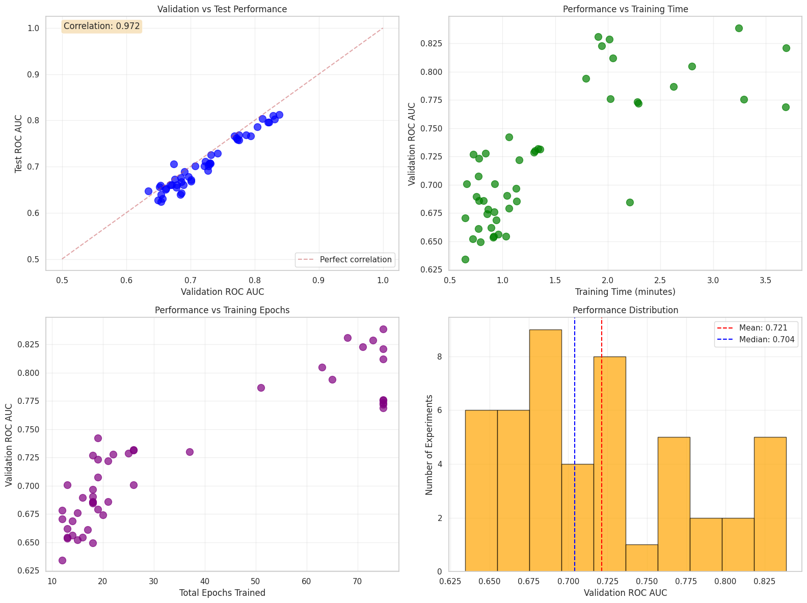

# GNN for Molecular Toxicity Prediction

This project implements a complete pipeline for predicting molecular toxicity using Graph Neural Networks (GNNs) on the Tox21 dataset. The primary goal is to classify molecules based on their toxicity, leveraging graph-based representations derived from SMILES strings. The implementation uses PyTorch and PyTorch Geometric.

## Table of Contents

- [Project Overview](#project-overview)
- [Key Features](#key-features)
- [Results](#results)
- [Project Structure](#project-structure)
- [Setup and Installation](#setup-and-installation)
- [Usage](#usage)
  - [Training a Model](#training-a-model)
  - [Hyperparameter Search](#hyperparameter-search)
- [Results Visualization](#results-visualization)

## Quick Start with Google Colab

For a quick, interactive way to run this project without a local setup, you can use the provided Jupyter notebook in Google Colab.

[](https://colab.research.google.com/github/sth-s/gnn-molecule-prediction/blob/main/notebooks/train_with_script.ipynb)

The notebook `notebooks/train_with_script.ipynb` contains all the necessary steps to clone the repository, install dependencies, and run the training script.

## Project Overview

This repository provides a framework for training and evaluating Graph Isomorphism Network (GIN) models for a binary classification task on the Tox21 dataset. The pipeline handles data loading, preprocessing of SMILES into molecular graphs, model training with hyperparameter tuning, and evaluation.

The project was developed as a practical application of GNNs to a real-world bioinformatics problem, demonstrating an end-to-end machine learning workflow.

## Key Features

- **Model Architecture**: Graph Isomorphism Network (GIN) for graph-level classification.
- **Dataset**: Tox21 dataset, with molecules represented by SMILES strings.
- **Data Preprocessing**: Automatic conversion of SMILES to graph representations with relevant atomic features.
- **Data Splitting**: Supports multiple data splitting strategies, including `random` and `scaffold` splits, to ensure robust evaluation.
- **Hyperparameter Optimization**: A grid search script (`hyp_search.py`) is provided to systematically find the best model configuration.
- **Reproducibility**: Experiments are seeded, and configurations are saved to ensure results can be reproduced.

## Results

A comprehensive grid search was performed to find the optimal hyperparameters. The best-performing model was then re-trained for an extended number of epochs. The reported test score was achieved using a scaffold split, which provides a more robust estimate of model performance on new, structurally different molecules.

- **Best Validation ROC AUC**: **0.841**
- **Test ROC AUC (Scaffold Split)**: **0.8147**

These results were achieved with the following hyperparameters:
- **Hidden Channels**: 128
- **Number of GIN Layers**: 3
- **Dropout Rate**: 0.2
- **Batch Size**: 32
- **Learning Rate**: 0.001

These scores are competitive for the Tox21 dataset, demonstrating the effectiveness of the GIN architecture for this task.

## Comparison with Benchmarks

The performance of this model is competitive with other GNN architectures evaluated on the Tox21 dataset. Below is a comparison with several published results (using scaffold splits where specified):

| Model                          | Test ROC AUC    | Comparison       |
| ------------------------------ | --------------- | ---------------- |
| **This Project (GIN)**         | **0.8147**      | -                |
| DeepChem (GraphConv)           | 0.829 ± 0.006   | Comparable       |
| MIT GNN (Kearnes et al., 2016) | 0.849 ± 0.006   | Higher           |
| Uni-Mol                        | 0.796           | Slightly Lower   |
| D-MPNN                         | 0.759           | Lower            |
| GMT (Graph Multiset Pooling)   | 0.773           | Lower            |

The model outperforms several established baselines and is comparable to the standard GraphConv implementation, confirming its effectiveness.

## Project Structure

```
.
├── data/                   # Raw and processed dataset
├── full_grid_search/       # Complete logs from the hyperparameter search
├── img/                    # Images and plots for the README
├── notebooks/              # Jupyter notebooks for exploration and visualization
├── scripts/                # Core Python scripts
│   ├── train.py            # Main script for training a single model
│   ├── hyp_search.py       # Script for running grid search
│   └── validate_setup.py   # Utility script to validate the environment
├── src/                    # Source code for data utilities, model, and training logic
├── .gitignore
├── LICENSE
├── README.md
└── requirements.txt
```

## Setup and Installation

1.  **Clone the repository:**
    ```bash
    git clone https://github.com/sth-s/gnn-molecule-prediction.git
    cd gnn-molecule-prediction
    ```

2.  **Create a virtual environment (recommended):**
    ```bash
    python3 -m venv .venv
    source .venv/bin/activate
    ```

3.  **Install dependencies:**
    The project requires specific versions of PyTorch and PyTorch Geometric. Please install them first, following the official instructions for your system. Then, install the remaining packages.
    ```bash
    pip install -r requirements.txt
    ```

## Usage

The core logic is accessible via scripts in the `scripts/` directory.

### Training a Model

To train a single model with a specific configuration, use `scripts/train.py`. The script accepts various command-line arguments to customize the training run.

**Example: Train the best model configuration**
```bash
python scripts/train.py \
    --hidden_channels 128 \
    --num_layers 3 \
    --dropout 0.2 \
    --batch_size 32 \
    --lr 0.001 \
    --epochs 300 \
    --early_stop_patience 20 \
    --exp_name "best_model_retrain"
```

To see all available options, run:
```bash
python scripts/train.py --help
```

### Hyperparameter Search

To run a grid search over a predefined hyperparameter space, use `scripts/hyp_search.py`. This script will systematically run training experiments for each configuration.

**Example: Run a grid search**
```bash
python scripts/hyp_search.py --output_dir "grid_search_run"
```

For a faster, abbreviated search (fewer epochs, limited combinations), use the `--fast_search` flag:
```bash
python scripts/hyp_search.py --output_dir "fast_grid_search" --fast_search
```

## Results Visualization

The results of the grid search are summarized in the plot below, showing the validation ROC AUC for different hyperparameter combinations.



Further analysis, such as plotting training curves, can be performed using the JSON log files generated during the grid search.